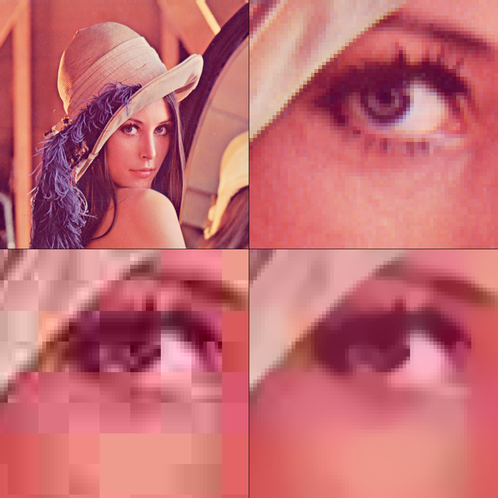
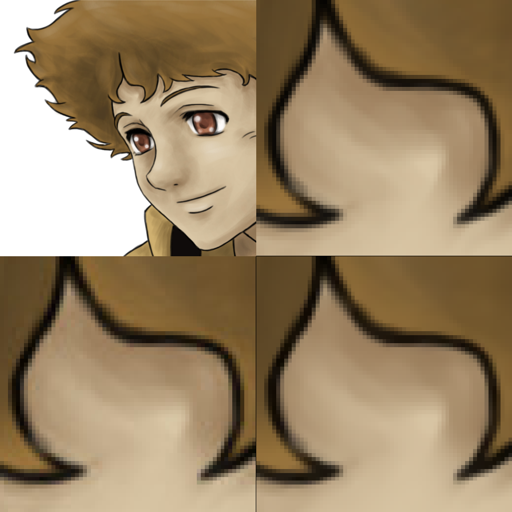

# jpeg2png
## Silky smooth JPEG decoding - no more artifacts!

Demo for `jpeg2png`

## Examples

* Top left: [original](images/lena.png) Lena image  

* Top right: original, 64x64 detail  
* Bottom left: [JPEG encoded](images/lena.jpg) at 10% quality with 4:2:0 chroma subsampling using the GIMP, 64x64 detail  

* Bottom right: [JPEG decoded](images/lena_restored.png) with jpeg2png using the default settings, 64x64 detail  

* Top left: [original](images/deviantart.png) Hige image ([source](http://whitedovehemlock.deviantart.com/art/Hige-315700935))  

* Top right: original, 64x64 detail
* Bottom left: [JPEG encoded](images/deviantart.jpg) at 90% quality with 4:4:4 chroma subsampling using the GIMP, 64x64 detail  

* Bottom right: [JPEG decoded](images/deviantart_restored.png) with jpeg2png using the default settings, 64x64 detail  

## Links

* [qjpegrest](http://viric.name/soft/qjpegrest/) is a tool that lets you try many different JPEG restoration methods (TV based, band-pass based and Huber MRF based). I learned from the code. See notes/qjpegrest.txt for installation help.
* [jpeg-quantsmooth](https://github.com/ilyakurdyukov/jpeg-quantsmooth) is program tries to recreate lost precision of DCT coefficients based on quantization table from jpeg image.
